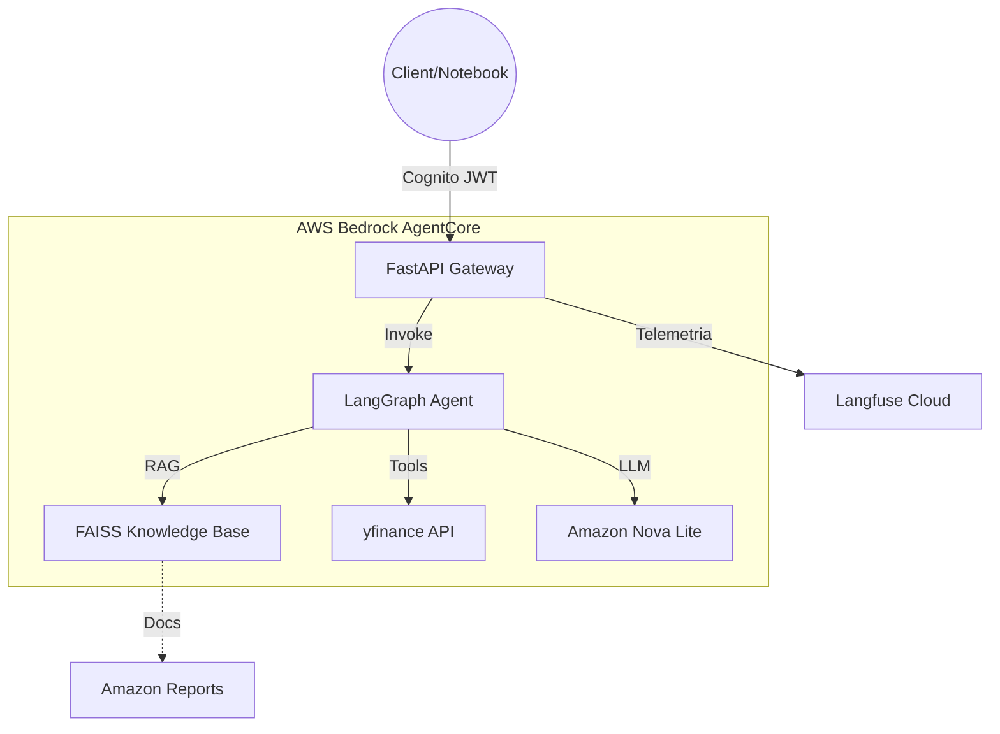

# 📈 AI Stock Agent on AWS Bedrock AgentCore


An enterprise-grade AI Agent solution for **Real-Time Financial Analysis**. Powered by Amazon Bedrock AgentCore, this agent orchestrates live market data retrieval and deep financial document analysis (RAG) through a secure, streaming-enabled FastAPI runtime.

---

## ✨ Key Features

| Feature | Description |
|:--- |:--- |
| 🛡️ **Zero-Trust Auth** | Secure ingress via AWS Cognito JWT validation. |
| ⚡ **SSE Streaming** | Sub-second token delivery for a fluid chat experience. |
| 📚 **Financial RAG** | Deep retrieval from Amazon 10-K and Quarterly reports via FAISS. |
| 📊 **Market Intel** | Live stock price and historical trend analysis via yfinance. |
| 🕵️ **Glass-Box AI** | Full execution traceability with Langfuse integration. |
| 🏗️ **Infrastructure as Code** | 100% reproducible deployment via Terraform. |

---

## 🏗️ System Architecture



---

## 🚀 Quick Start (Deployment)

### 1. Configure Infrastructure
```hcl
# terraform/terraform.tfvars
aws_region    = "us-east-1"
project_name  = "stock-agent"
langfuse_public_key = "pk-lf-..."
langfuse_secret_key = "sk-lf-..."
```

### 2. Deploy Cloud Resources
```bash
cd terraform
terraform init && terraform apply -auto-approve
```

### 3. Build & Push Runtime
```bash
cd agent
# Run the deployment helper
bash ../terraform/scripts/deploy_container.sh
```

---

## 🧪 Demonstration & Validation

The project includes a comprehensive **Demo Notebook** at `notebook/demo.ipynb`. It provides a step-by-step walkthrough of:

1.  **Authentication**: Creating a test user and obtaining secure tokens.
2.  **Streaming Invocations**: Watching the agent "think" and retrieve data in real-time.
3.  **Financial Queries**:
    -   *Current Stock Prices* (Real-time data fetch).
    -   *Earnings Analysis* (RAG from 10-K documents).
    -   *AI Business Review* (Cross-referencing reports and market trends).

---

## 🛠️ Tech Stack & Design

*   **Intelligence**: LangGraph (ReAct cycle), Amazon Nova Lite LLM.
*   **Vector Engine**: FAISS with Amazon Titan Embed Text V2.
*   **Observability**: Langfuse (Spans, Traces, Cost tracking).
*   **Infrastructure**: Terraform, ECR, Secrets Manager, AgentCore Runtime.

---

> [!IMPORTANT]
> **Check the Observability Guide**: To see the "Gold Standard" of debugging, run a query and check your [Langfuse Dashboard](https://cloud.langfuse.com). Look for the `stock-agent-call-final-70` traces for sub-step analysis.

## 🤝 Contributing

This project is built for high-performance financial research. Feel free to fork and add more specialized tools or data loaders.

---
**Maintained by Kevin Lopez Pastor — 2026**
